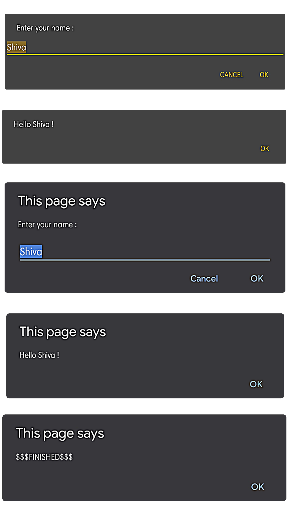

# JavaScript

> Program :

>>JavaScript

```js
alert("Hello " + prompt("Enter your name :","Shiva") + " !");
```

>> HTML

```html
<?xml version="1.0" encoding="UTF-8" ?>
<body>
  <script>
    (function () {
      alert("Hello " + prompt("Enter your name :","Shiva") + " !");
    })();
    alert('$$$FINISHED$$$');
  </script>
</body>
```

> Output :



